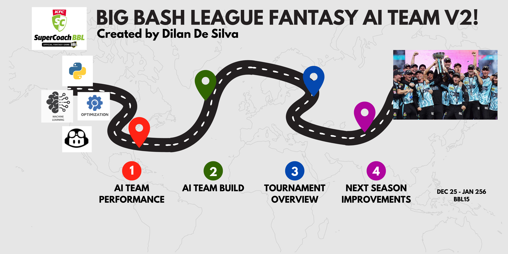

## Welcome
This is my project repository for my second iteration of my Big Bash League (BBL) AI Fantasy Team. By leveraging the ball by ball data of each match from the previous ten BBL seasons, I created a sophisticated decision making AIML system which leverages a bespoke optimisation process and several ML forecasting models to select my initial 15 player squad prior to the start of the tournament and to identify the optimal player trades for each of the 9 rounds during the season.

For this Big Bash Season I trialled two stratgies:
1. Champion Strategy (ChrisLynnTheorem): Decisions are based off the player's expected points.
2. Challenger Strategy (MitchCarloSwepson): Decisions are based of the player's expected points and variability in points by leveraging simulations.
3. Control/ Human Strategy (PassedTheEyeTest): My personal account which will be used for comparison.

Majority of the process will be the same for the Champion and Challenger strategy, with the the Champion strategy being a subset (less complex version) of the Challenger strategy.

## AI Team Performance
### Individual Performance

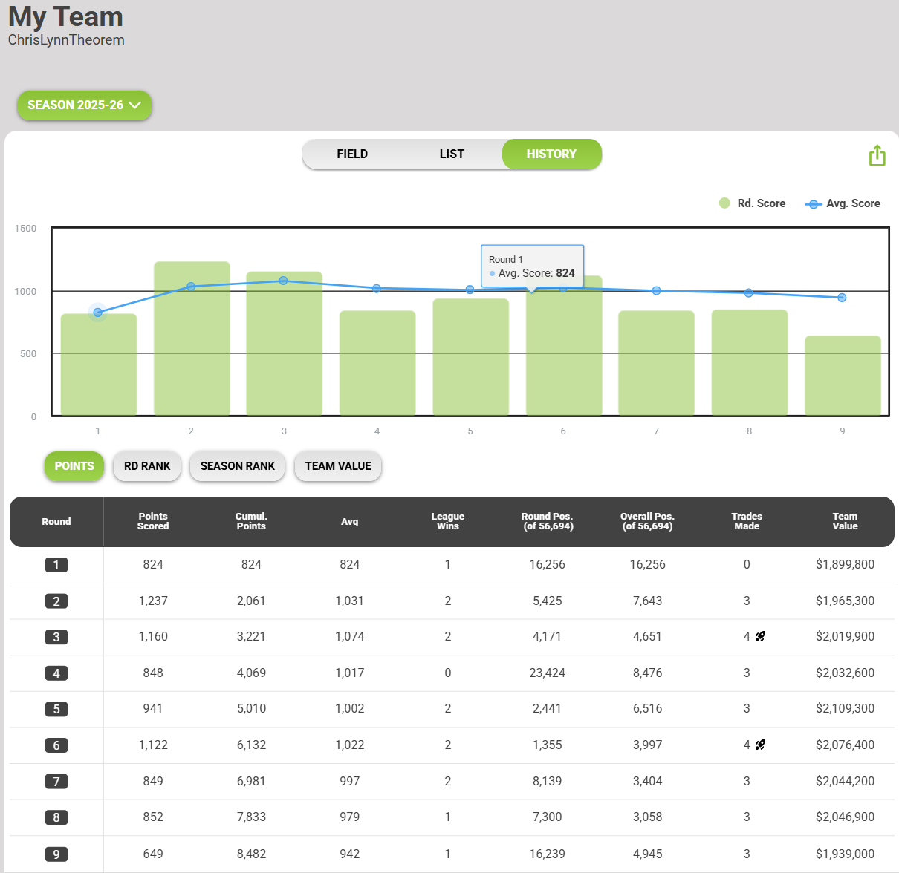

### League Performance
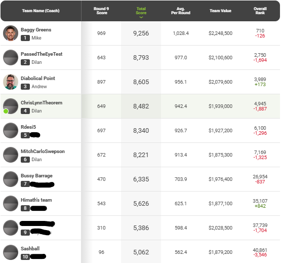

## AI Team Build
### Overall Decision Making System
#### Champion System
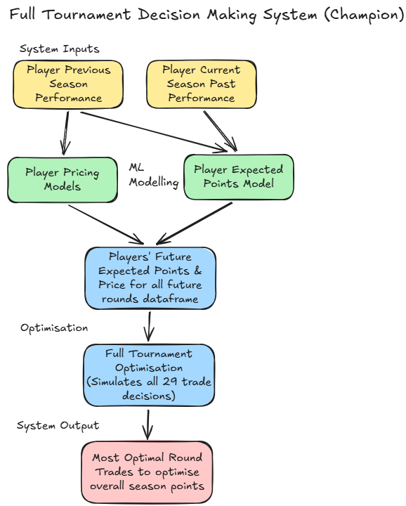

#### Challenger System
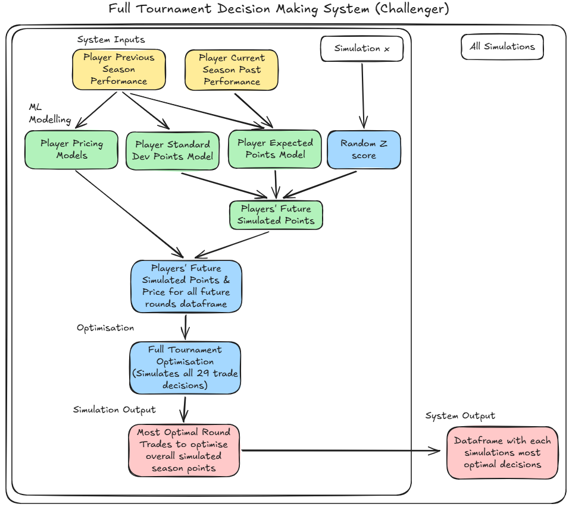

### Data Collection
- **Raw Previous Season Data:** Extracted ball by ball BBL data from Cricsheet (https://cricsheet.org/downloads/) for each game in BBL01 to BBL13 which was stored in a single CSV file. Special thank you and shout out to Stephen Rushe of Cricsheet for creating this amazing dataset, which I have leveraged primarily for this project!

- **Raw Current Season Data:** Collected by yours truly, every morning after the BBL game, I collected the data manually from the BBL Supercoach for player points and price data and from cricinfo for traditional batting and bowling data attributes.

- **Null & Missing Data:** Many rows in the data had some of the columns missing values or nulls. This was mainly tackled by overriding these fields as 0, which is appropriate as most variables lower limit is 0.

- **Exclusion:** Rain affected games were manually removed. Only the latest 10 seasons of data was used.

- **Data/ Feature Imputation:** As the modelling data is built of past player performances, players who did not contribute will be incorrectly excluded from the dataset. Additional loop was added to include non scoring players woth default features. 

### Response Variable and Explanatory Feature Creation
- **Response Variable:** Number of Fantasy Points (Bowling + Batting) the player will get in the game. As the raw data did not include individual fielding statistics, these points were added separately in the optimisation.
- **Explanatory Features Considered:** 
1. Player's previous season/s fantasy points summary statistics (up to 3 seasons prior)
2. Player's previous season/s batting statistics (up to 3 seasons prior)
3. Player's previous season/s bowling statistics (up to 3 seasons prior)
4. Player's previous season/s batting role (up to 3 seasons prior)
5. Player's previous season/s bowling role (up to 3 seasons prior)

6. Player's current season fantasy points summary statistics
7. Player's current season batting role
8. Player's current season bowling role (incl power surge bowlers)

### Model Build
#### Modelling Suite
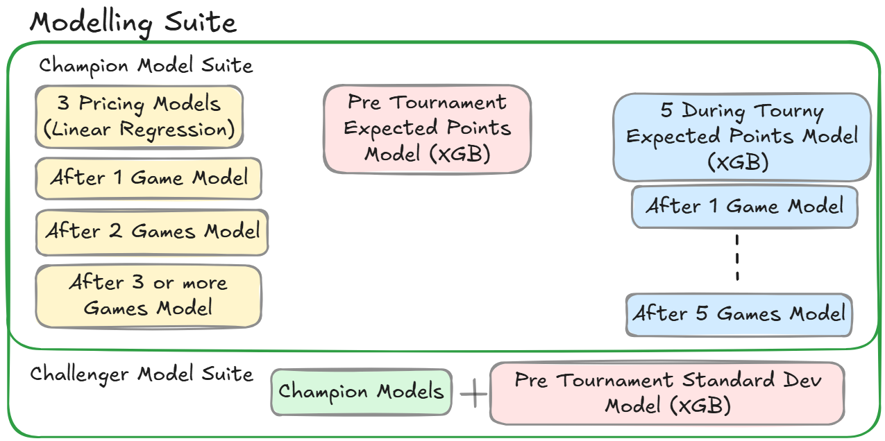

#### Linear Regression Model Build
- **Modelling Data Split:** No data split was used, as I used all the data in training to identify the exact relationship/ formula of the current player price.
- **Assumed Formula:** Current Player Price =  a x player previous price + b x previous games(1 - 3) average points
- **Model Performance Metrics:** MAE, MAPE, RMSE, R2 & Actual vs Expected plots to assess the overall model predictive power.
- **Pricing Model Accuracy:** 1 Game Model: MAPE 0.68%, 2 Game Model: MAPE 0.56% & 3+ Game Model: MAPE 1.27%.

#### XGB Model Build
- **Modelling Data Split:** 80% of the data randomly allocated for training set and remaining 20% for testing set. 
- **Model Pipeline:** Allows the user to select which variables to consider in the model, EDA between response variable and explanatory features, model builder loop and model performance metrics.
- **Model objects considered:** Linear Regression, Decision Trees, Random Forest, Gradient Boosting Machine, Explainable Boosting Machine & Extreme Gradient Boosting Machine.
- **Hyperparameter tuning:** For the machine learning model objects, unique hp grids were used to optimise the models, leveraging a 5 fold cross validation process on the training data to identify the best parameters. 
- **Model Performance Metrics:** MAE, MAPE, RMSE, R2 & Actual vs Expected plots to assess the overall model predictive power. Variable feature importance was used to assess most impactful features.
- **Pre Tournament Points Model Accuracy:** Expected Value Points Model: MAE (train/test) 10.8/12.9 points & Standard Deviation Points Model: MAE (train/test) 5.5/9.8 points.
- **During Tournament Points Model Accuracy:** Expected Value Points Model - 1 Game: MAE (train/test) 10.7/12.0 points, 2 Games: MAE 9.7/11.4 points, 3 Games: MAE 9.3/12.8 points, 4 Games: MAE 9.6/13.3 points & 5 Games: MAE 8.9/12.9 points

### Model Scoring Process
- **Overall process:** The scoring process first extracts the latest round's actual data for every player to rebuild the dataset used to create the model. Then the latest performance data is fed into the model to predict the expected fantasy points for every active player's remaining games. This process creates a final dataframe which has the expected fantasy points predictions per player. 

### Optimisation
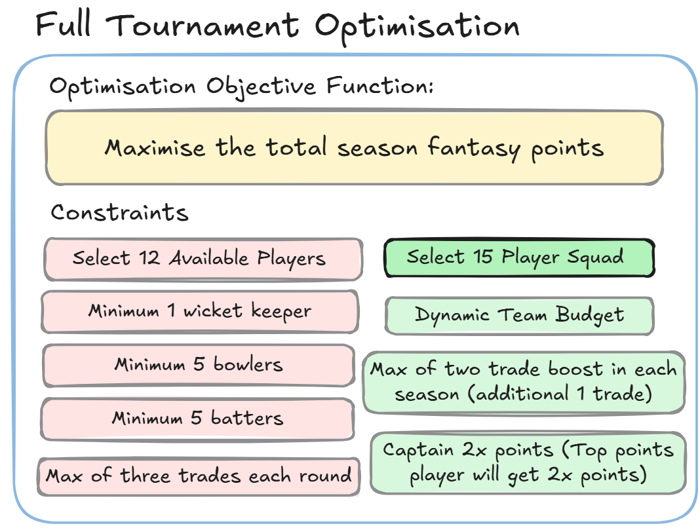

- **Optimisation set up:** Extract the final player scoring dataset and join additional fantasy features required for optimisation constraints e.g. player price. The dataset is then sliced and aggregated up to a player level.

- **Pre Tournament Optimisation Goal:** 
1. Identify the optimal number of players in the squad
2. Select the base squad (12 - 16 players) which will maximise the total season fantasy points.

- **During Tournament Optimisation Goal:** 
1. For the upcoming round, select the most optimal player trades which will maximise the remaining season fantasy points.
2. Identify optimal round to use trade boost (additional 1 trade)

### System Highlights
#### 1. Planning for the entire season!
- Before the start of the tournament, the AI team decided to select Will Sunderland the captain of the Melbourne Renegades in preparation for their double gameweek in round 8. The optimisation understood the difficulty of this round and decided to stock one additional player from the start!

#### 2. Leveraging the Bench!
- Matthew Wade, a player selected by the AI team in round 2, was injured and unavailable for the next round. Usually the optimisation aims to remove unavailable players, but in this unique scenario, it decided to bench Wade instead as it required more money for the most optimal trades. This trade would not be possible it the old system and allowed the AI team to bring in a more expensive player for the upcoming round!

#### 3. Leveraging current season data!
- The Melbourne Stars had two double gameweeks this season (Round 3 & Round 5). At the point of the first double, only two games of data was available, and thus the AI leveraged more past season data to elect Glenn Maxwell as the captain. But during the second double, with four games of data availabe, the AI leverage more of the current season data electing to captain the more inform, Tom Curran, over Maxwell! This decision demonstrated the system's ability to learn as it gets more current season data!

## Tournament Overview

### <ins>Round 1</ins>

**Selected Team**

**Champion vs Challenger vs Semi-Pro Result**
| Team       | Round Points   | Round Rank | Overall Rank |
| :---       |     :---:      | :---:      | :---:        |
| Champion   | 824            | 16256      | 16256        |
| Challenger | 824            | 16256      | 16256        |
| Control    |                |            |              |

### <ins>Round 2</ins>
**AI Team Round Trades**

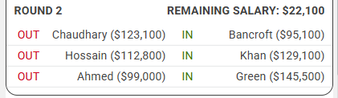

**Round Summary**

**Selected Team**

**Champion vs Challenger vs Semi-Pro Result**
| Team       | Round Points   | Round Rank | Overall Rank |
| :---       |     :---:      | :---:      | :---:        |
| Champion   | 1237           | 5425       | 7643         |
| Challenger | 1147           | 9269       | 10343        |
| Control    |                |            |              |

### <ins>Round 3</ins>
**AI Team Round Trades**

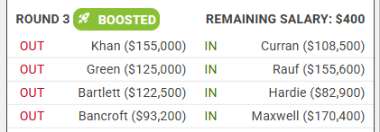

**Round Summary**

**Selected Team**

**Champion vs Challenger vs Semi-Pro Result**
| Team       | Round Points   | Round Rank | Overall Rank |
| :---       |     :---:      | :---:      | :---:        |
| Champion   | 1160           | 4171       | 4651         |
| Challenger | 1207           | 2545       | 5505         |
| Control    |                |            |              |

### <ins>Round 4</ins>
**AI Team Round Trades**

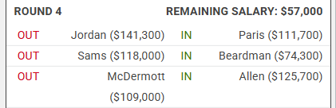

**Round Summary**

**Selected Team**

**Champion vs Challenger vs Semi-Pro Result**
| Team       | Round Points   | Round Rank | Overall Rank |
| :---       |     :---:      | :---:      | :---:        |
| Champion   | 848            | 23,424     | 8,476        |
| Challenger | 831            | 24414      | 9559         |
| Control    |                |            |              |

### <ins>Round 5</ins>
**AI Team Round Trades**

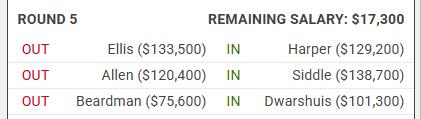

**Round Summary**

**Selected Team**

**Champion vs Challenger vs Semi-Pro Result**
| Team       | Round Points   | Round Rank | Overall Rank |
| :---       |     :---:      | :---:      | :---:        |
| Champion   | 941            | 2,441      | 6,516        |
| Challenger | 922            | 3442       | 7683         |
| Control    |                |            |              |

### <ins>Round 6</ins>
**AI Team Round Trades**

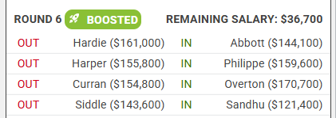

**Round Summary**

**Selected Team**

**Champion vs Challenger vs Semi-Pro Result**
| Team       | Round Points   | Round Rank | Overall Rank |
| :---       |     :---:      | :---:      | :---:        |
| Champion   | 1122           | 1,355      | 3,997        |
| Challenger | 974            | 6416       | 6634         |
| Control    |                |            |              |

### <ins>Round 7</ins>
**AI Team Round Trades**

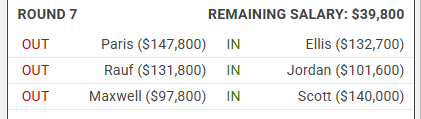

**Round Summary**

**Selected Team**

**Champion vs Challenger vs Semi-Pro Result**
| Team       | Round Points   | Round Rank | Overall Rank |
| :---       |     :---:      | :---:      | :---:        |
| Champion   | 849            | 8,139      | 3,404        |
| Challenger | 832            | 9668       | 6064         |
| Control    |                |            |              |

### <ins>Round 8</ins>
**AI Team Round Trades**

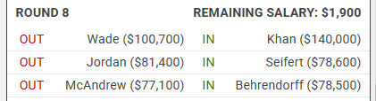

**Round Summary**

**Selected Team**

**Champion vs Challenger vs Semi-Pro Result**
| Team       | Round Points   | Round Rank | Overall Rank |
| :---       |     :---:      | :---:      | :---:        |
| Champion   | 852            | 7,300      | 3,058        |
| Challenger | 812            | 10775      | 5844         |
| Control    |                |            |              |

### <ins>Round 9</ins>

**AI Team Round Trades**

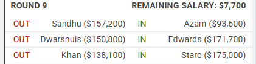

**Round Summary**

**Selected Team**

**Champion vs Challenger vs Semi-Pro Result**
| Team       | Round Points   | Round Rank | Overall Rank |
| :---       |     :---:      | :---:      | :---:        |
| Champion   | 649            | 16,239     | 4,945        |
| Challenger | 672            | 15103      | 7169         |
| Control    |                |            |              |

## AI Team Next Season Improvements

### Feature Creation
- **Power Surge:** Currently used basic power surge features, but next season complete history over the last 5 years should be used to build more accurate features.
- **Fielding Points:** Improved methodology for the fielding points proxy or even individual past season fielding features leveraging webscraping of cricinfo scorecards.
- **Player Labelling:** Develop approach to assign player labels for all modelling data (e.g. domestic vs international players, rookie player vs veteran player etc.)
- **Pre Tournament other domestic tournament records:** Currently new players to the competition, either young players or international signings can not be differentiated due to no past season records. Other domestic tournaments can be used as a proxy to help differentiate players. 
- **Improve Scoring Process:** Reduce daily manual scoring process during BBL season by leveraging webscraping to automate the data capturing process from Cricinfo and BBL Supercoach App. Should look into automating scoring and optimisation process leveraging agents and github actions.

### Modelling
- **Alternative Modelling Techniques:** Currently all models are XGBoost models, but should look into 
- **Explainable & Casual Modelling Techniques:** As can be seen in many of the models, they consist of several feature all providing similar amounts of information. Leveraging advanced explainable & casual ML techniques could help dive deeper to identify the true key drivers and features of player performance.
- **Rebuilding current models:** Due to the numerous models built and features created, their are several different options and experiments which can be considered to construct the best solution. Though I consider several approaches, due to time limitations and the face pace of the tournament I definetely did not exhaust all possible modelling ideas and I would like to focus deeper into the raw modelling.
- **Adjustment Factors:** By shifting to the response variable to the average points across the entire season, I am unable to leverage previously created game specific features such as Venue & Opposition. My initial idea is that post modelling adjustment factors can be created to add this additional information prior to optimisation.
-**Ordinal Performance Metrics:** As the strategy is only allowed to make limited trades to change the team, not only is the magnitude of points important, but the models ability to accurately rank the players correctly. A bespoke performance metric/s should be designed to consider this.

### Strategy (via Optimisation)
- This is the section which I developed the most enhancements and I was very happy with its performance. 
- **Addition of new rules:** Build additional constraints to capture new fantasy rules
